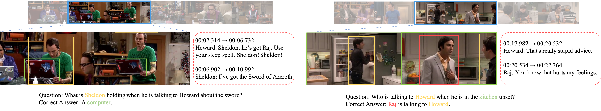
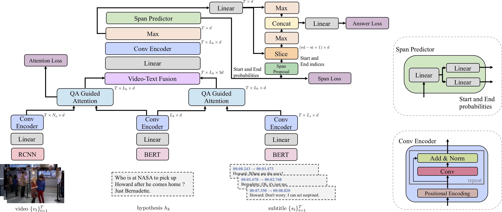
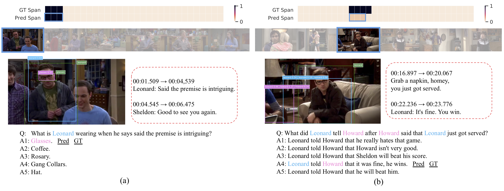

## Generative Question Answering for Video QA.



In this repository, we reference tje PyTorch Implementation of the STAGE model, along with basic 
preprocessing and evaluation code for TVQA+ dataset, and extend it to Generative Question Answering. 


### Resources
- Data: [TVQA+ dataset](http://tvqa.cs.unc.edu/download_tvqa_plus.html)
- Website: [http://tvqa.cs.unc.edu](http://tvqa.cs.unc.edu)
- Related works: [TVQA+: Spatio-Temporal Grounding for Video Question Answering](https://arxiv.org/abs/1904.11574)<br>

### Model
- **STAGE Overview**. Spatio-Temporal Answerer with Grounded Evidence (STAGE), a unified framework that grounds evidence in both the spatial and temporal domains to answer questions about videos.  



- **Prediction Examples**
 

### Requirements
- Python 2.7
- PyTorch 1.1.0 (should work for 0.4.0 - 1.2.0)
- tensorboardX
- tqdm
- h5py
- numpy


### Training and Evaluation
1, Download and uncompress preprocessed features from 
[Google Drive](https://drive.google.com/open?id=1GnknXfs9qKE-WVaUgUeKfCTLHjyzqCHG).

```
& uncompress the file into project root directory, you should get a dir `tvqa_plus_stage_features` 
containing all the required feature files.
cd $PROJECT_ROOT; tar -xf tvqa_plus_stage_features_new.tar.gz
```
[gdrive](https://github.com/prasmussen/gdrive) is a good tool to use for downloading the file. 
**The features are changed, you have to re-download the features if you have our previous version**

2, Run in `debug` mode to test your environment, path settings:
```
bash run_main.sh debug
```

3, Train the full STAGE model:
```
bash run_main.sh --add_local
```
note you will need around 30 GB of memory to load the data. Otherwise, you can additionally add `--no_core_driver` flag to stop loading 
all the features into memory. The trained model and config file are stored at `${$PROJECT_ROOT}/results/${MODEL_DIR}`

4, Inference
```
bash run_inference.sh --model_dir ${MODEL_DIR} --mode ${MODE}
```
`${MODE}` could be `valid` or `test`. After inference, you will get a `${MODE}_inference_predictions.json` 
file in `${MODEL_DIR}`, which is similar to the sample prediction file here `eval/data/val_sample_prediction.json`.

5, Evaluation
```
cd eval; python eval_tvqa_plus.py --pred_path ../results/${MODEL_DIR}/valid_inference_predictions.json --gt_path data/tvqa_plus_val.json
```